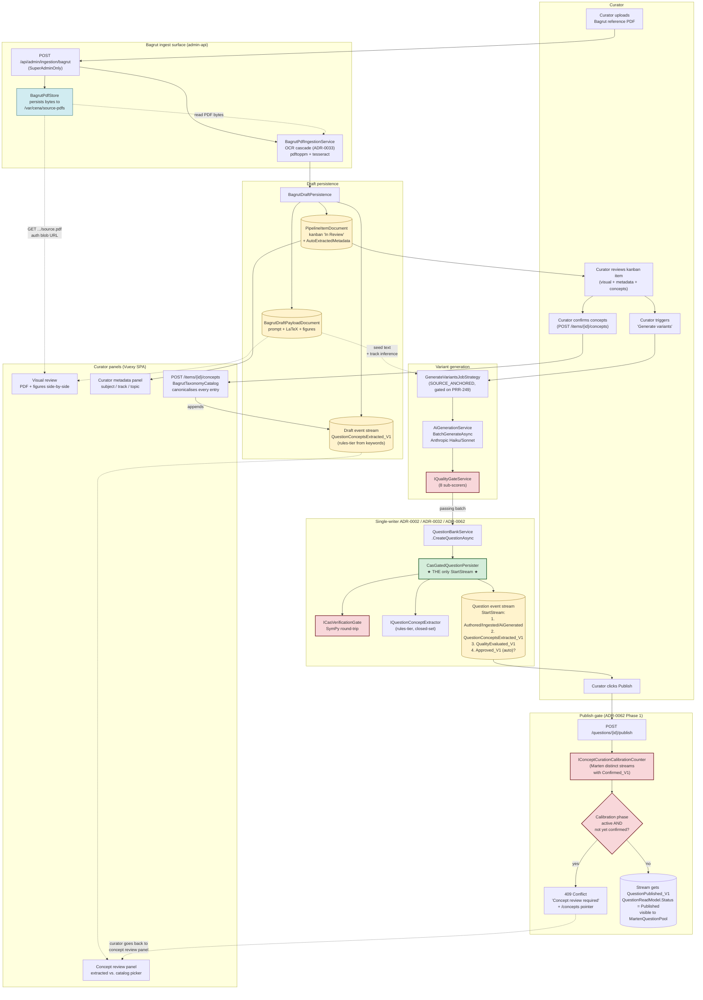

# PDF → Question flow (ADR-0062 Phase 1)

End-to-end picture of what happens when a curator uploads a Bagrut reference PDF and a published question lands in the bank, with concept extraction folded into the canonical CAS-gated write path.

## Mermaid diagram (renders inline on GitHub / GitLab / VS Code Markdown preview)



## Where each step lives in code

| Step | Type | File |
|---|---|---|
| Upload endpoint | Route | [BagrutIngestEndpoints.cs](../../src/api/Cena.Admin.Api/Ingestion/BagrutIngestEndpoints.cs) |
| OCR cascade | Service | [BagrutPdfIngestionService.cs](../../src/api/Cena.Admin.Api/Ingestion/BagrutPdfIngestionService.cs) |
| Draft kanban + extracted event | Service | [BagrutDraftPersistence.cs](../../src/api/Cena.Admin.Api/Ingestion/BagrutDraftPersistence.cs) |
| Curator concept panel | Routes | [QuestionConceptsEndpoints.cs](../../src/api/Cena.Admin.Api/Ingestion/QuestionConceptsEndpoints.cs) |
| Closed-set canonicaliser | Domain | [BagrutTaxonomyCatalog.cs](../../src/actors/Cena.Actors/Mastery/BagrutTaxonomyCatalog.cs) |
| Variant generation | Job | [GenerateVariantsJobStrategy.cs](../../src/api/Cena.Admin.Api/Ingestion/GenerateVariantsJobStrategy.cs) |
| Single-writer persister | Domain | [CasGatedQuestionPersister.cs](../../src/actors/Cena.Actors/Cas/CasGatedQuestionPersister.cs) |
| Concept extractor | Domain | [RulesOnlyConceptExtractor.cs](../../src/actors/Cena.Actors/Mastery/Extraction/RulesOnlyConceptExtractor.cs) |
| Calibration counter | Domain | [MartenConceptCurationCalibrationCounter.cs](../../src/actors/Cena.Actors/Mastery/Extraction/MartenConceptCurationCalibrationCounter.cs) |
| Publish-gate handler | Helper | [PublishCalibrationGate.cs](../../src/api/Cena.Admin.Api/Concepts/PublishCalibrationGate.cs) |

## What to expect at each stage

1. **Upload** — bytes hit local volume; OCR runs synchronously (cascade is blocking by design — small Bagrut PDFs, < 5 seconds).
2. **Kanban "In Review"** — a `PipelineItemDocument` row appears with auto-extracted `subject=math`, `track=5u/4u/3u` parsed from exam code, `taxonomyNode` keyword-classified from prompt+LaTeX.
3. **Visual review** — curator sees original PDF in browser via auth blob URL plus the system's recreated stem + figure.
4. **Concept review** — extracted set (one Primary, low confidence) shown next to the closed-set catalog (~73 leaves). Curator one-clicks confirm or overrides; `QuestionConceptsConfirmed_V1` lands on the draft stream.
5. **Generate variants** — Anthropic batch returns N candidates; each that passes the quality gate enters the persister.
6. **Persister atomic batch** — for every persisted variant: `QuestionAuthored/Ingested/AiGenerated_V2` → `QuestionConceptsExtracted_V1` → `QuestionQualityEvaluated_V1` → optional `QuestionApproved_V1`. ALL in one `StartStream<QuestionState>` call so partial commits are impossible.
7. **Publish** — for the first 200 variants in the calibration corpus, the curator must confirm concepts on each variant before publish. After 200, extraction stands; one-click override surfaced in the SPA.

## How to import to draw.io

draw.io natively imports Mermaid:
1. Open https://app.diagrams.net (or VS Code "Draw.io Integration" extension).
2. **Arrange → Insert → Advanced → Mermaid…**
3. Paste the entire ` ```mermaid ` block above.
4. Click **Insert**. The diagram lays itself out and is fully editable as native draw.io shapes.

The .drawio XML file with the same diagram lives at [adr-0062-pdf-to-question-flow.drawio](./adr-0062-pdf-to-question-flow.drawio) (importable directly).
