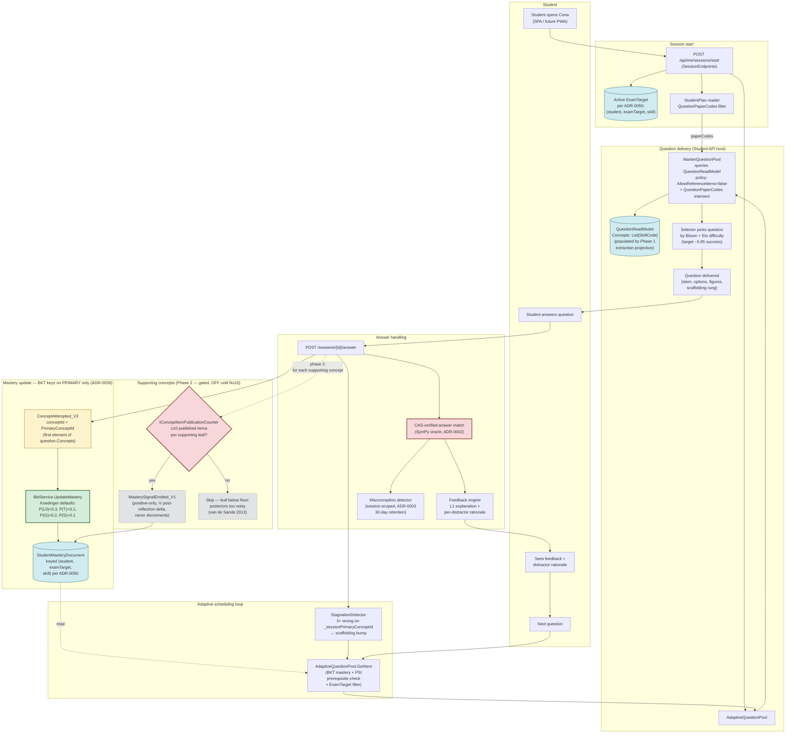

# Student session → concept mastery flow (ADR-0062 + ADR-0039 + ADR-0050)

End-to-end picture of a student answering a question and how the multi-concept tagging from Phase 1 feeds the BKT mastery loop, while keeping ADR-0039 (single-skill BKT) intact.

## Mermaid diagram



## How concept mastery actually moves

### What's live today (Phase 1)

- The question's full concept set (primary + supporting) lives on the event stream and is projected onto `QuestionReadModel.Concepts`.
- `MartenQuestionPool` reads that field and indexes published questions by **every** concept in the set, so concept-keyed selectors (PSI, CAT) see the full coverage.
- BKT continues to fire on **`PrimaryConceptId` only** — the primary is the first element of `QuestionState.ConceptIds` after replay. This preserves `ADR-0039` single-skill BKT semantics so the existing identifiability bounds (Koedinger defaults, ≥10-items-per-skill stability floor) are not violated.

### What's deferred (Phase 2, gated)

- `MasterySignalEmitted_V1` nudge channel for **supporting** concepts. Half the post-reflection delta, positive-only, never decrements — keeps the math from over-claiming on weak evidence.
- Gated by `IConceptItemPublicationCounter`: a leaf only starts receiving nudges once **≥10 published items** carry it. Below the floor, posteriors are too noisy to defend (van de Sande 2013).
- Default impl is `NullConceptItemPublicationCounter` → returns 0 → gate stays CLOSED. Phase 2 turn-on is a one-line registration swap to a Marten-backed counter, never accidental.

### Why BKT keys on `(student, examTarget, skill)` not `(student, skill)`

ADR-0050: a student preparing for two different Bagrut tracks (e.g. 4u in 11th + 5u in 12th) needs SEPARATE mastery rows because the same `SkillCode` ("math.calculus.derivative-rules") shows up at both tracks with different difficulty distributions. Collapsing across tracks contaminates the posterior. The exam-target key is the lever that lets the student have multiple "in-flight" mastery profiles.

## Where each step lives in code

| Step | File |
|---|---|
| Session start endpoint | [SessionEndpoints.cs](../../src/api/Cena.Student.Api.Host/Endpoints/SessionEndpoints.cs) |
| Adaptive question selection | [AdaptiveQuestionPool.cs](../../src/actors/Cena.Actors/Serving/AdaptiveQuestionPool.cs) |
| Pool query (Marten-backed) | [MartenQuestionPool.cs](../../src/actors/Cena.Actors/Serving/MartenQuestionPool.cs) |
| Concept set projection | [QuestionListProjection.cs](../../src/actors/Cena.Actors/Questions/QuestionListProjection.cs) |
| Aggregate replay (event-sourced) | [QuestionState.cs](../../src/actors/Cena.Actors/Questions/QuestionState.cs) |
| Answer endpoint | [SessionEndpoints.cs](../../src/api/Cena.Student.Api.Host/Endpoints/SessionEndpoints.cs) |
| BKT update | [BktService.cs](../../src/actors/Cena.Actors/Mastery/BktService.cs) |
| Stagnation tracker | [StudentActor.Commands.cs](../../src/actors/Cena.Actors/Students/StudentActor.Commands.cs) |
| Phase 2 stability gate (placeholder) | [IConceptItemPublicationCounter.cs](../../src/actors/Cena.Actors/Mastery/Extraction/IConceptItemPublicationCounter.cs) |

## How to import to draw.io

Same as the PDF flow:
1. https://app.diagrams.net.
2. **Arrange → Insert → Advanced → Mermaid…**
3. Paste the ` ```mermaid ` block above.
4. **Insert** — diagram becomes fully editable native shapes.

Importable .drawio XML at [adr-0062-student-mastery-flow.drawio](./adr-0062-student-mastery-flow.drawio).
