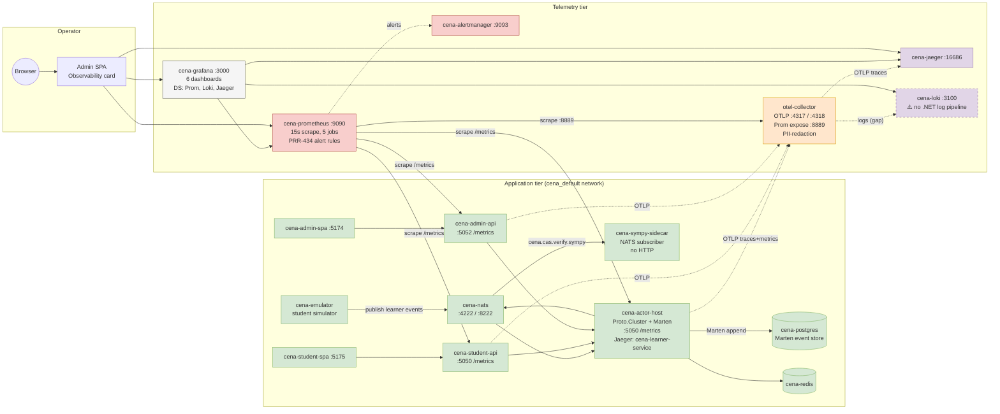

# Observability Topology Diagram

The full editable diagram is at [observability-topology.drawio](observability-topology.drawio) —
open in [draw.io](https://app.diagrams.net) (free, browser-based) or in
**Visio** (File → Open → select the `.drawio` file; Visio 2019+ imports
draw.io's mxGraph format directly), or use the VS Code "Draw.io Integration"
extension to view inline.

The Mermaid version below renders directly in GitHub / GitLab / VS Code
preview and is the canonical "read in PR" view:

## Reading the diagram

- **Solid arrows**: pull / scrape (Prometheus → service) and synchronous calls.
- **Dotted arrows**: push / export (services → OTel collector → Jaeger/Loki).
- **Two tiers**: the application tier (left/blue) carries real student traffic;
  the telemetry tier (right/yellow) is the read-only observability stack.
- **Two service-name namespaces**: actor-host registers itself as
  `cena-learner-service` in OpenTelemetry resource attributes (per
  `Program.cs` `.AddService(serviceName: ...)`) but the Prometheus job is
  named `cena-actor-host`. This is intentional — Jaeger groups by the OTel
  service name, Prometheus groups by scrape job.

## What flows where

| Signal type | Producer            | Transport                    | Sink         | UI                    |
|-------------|---------------------|------------------------------|--------------|-----------------------|
| Metrics     | ASP.NET services    | `/metrics` Prometheus pull   | Prometheus   | Grafana, :9090        |
| Metrics     | OTel SDK in .NET    | OTLP gRPC :4317              | OTel → Prom  | Grafana, :9090        |
| Traces      | OTel SDK in .NET    | OTLP gRPC :4317              | OTel → Jaeger| Jaeger UI :16686      |
| Logs        | (none — see gap)    | OTLP gRPC :4317              | OTel → Loki  | Grafana Explore       |
| Alerts      | Prometheus rules    | Alertmanager push            | Alertmanager | :9093                 |
