# Readiness Task Dependency Graph

Generated: 2026-04-14 | Source: `config/readiness-dependencies.json`

Run `npx tsx scripts/readiness-dependency-check.ts` for live validation.

## Progress

| Status | Count |
|--------|-------|
| Done | 20 |
| In Progress | 2 |
| Pending | 15 |
| **Total** | **37** |
| **Progress** | **54%** |

## Dependency Graph

```mermaid
graph TD
  classDef done fill:#4caf50,stroke:#333,color:#fff
  classDef inprog fill:#ff9800,stroke:#333,color:#fff
  classDef pending fill:#e0e0e0,stroke:#666,color:#333
  classDef tier0 stroke:#f44336,stroke-width:3px

  RDY-002["002: RTL"]:::done --> RDY-015["015: A11y Sweep"]:::done --> RDY-030["030: A11y Automation"]:::pending
  RDY-003["003: Prerequisites"]:::done --> RDY-007["007: DIF"]:::done
  RDY-003 --> RDY-018["018: Sympson-Hetter"]:::done
  RDY-006["006: ML Exclusion"]:::done --> RDY-014["014: Misconception"]:::done
  RDY-013["013: Worked Examples"]:::done --> RDY-014
  RDY-033["033: Error Patterns"]:::pending -.->|enhances| RDY-014
  RDY-009["009: OpenAPI"]:::inprog --> RDY-010["010: API Versioning"]:::pending
  RDY-017["017: NATS DLQ"]:::done --> RDY-017a["017a: DLQ Follow-ups"]:::pending
  RDY-020["020: SignalR Bridge"]:::done --> RDY-034["034: Flow State API"]:::pending -.->|enhances| RDY-016["016: Flow State UX"]:::done
  RDY-023["023: Diagnostic"]:::done --> RDY-024["024: BKT Cal. A"]:::done --> RDY-024b["024b: BKT Cal. B"]:::pending
  RDY-032["032: Pilot Export"]:::pending --> RDY-024b
  RDY-032 --> RDY-028["028: Bagrut Baseline"]:::pending
  RDY-019["019: Bagrut Corpus"]:::pending --> RDY-028
  RDY-019 --> RDY-019a["019a: Bagrut Follow-ups"]:::pending
  RDY-027["027: Glossary"]:::pending --> RDY-004["004: Arabic Trans."]:::pending

  RDY-001["001: CSAM"]:::done
  RDY-005["005: Legal"]:::pending
  RDY-008["008: Aggregate ADR"]:::done
  RDY-011["011: Health Probes"]:::done
  RDY-012["012: Circuit Breakers"]:::done
  RDY-021["021: Projection Tests"]:::done
  RDY-022["022: Session Timer"]:::done
  RDY-025["025: Deployment"]:::pending
  RDY-026["026: Arabic Input"]:::inprog
  RDY-029["029: Security"]:::pending
  RDY-031["031: Dep. Graph"]:::done
```



## Critical Path (Pending Tasks Only)

The longest remaining dependency chain:

```
RDY-009 (OpenAPI, in-progress) -> RDY-010 (API Versioning)
```
2 remaining tasks. RDY-009 is already in progress.

Other notable pending chains:
- `RDY-027 -> RDY-004` (2 tasks, both pending — blocks Arabic deployment, Tier 0)
- `RDY-019 -> RDY-019a` (2 tasks, both pending — Bagrut content pipeline)
- `RDY-019 + RDY-032 -> RDY-028` (convergent — Bagrut baseline needs both)
- `RDY-024 + RDY-032 -> RDY-024b` (convergent — BKT Phase B needs pilot data)

## Parallelizable Tasks (Ready Now)

All dependencies met — can be started immediately:

| Task | Title | Tier |
|------|-------|------|
| **RDY-032** | Pilot Data Export Pipeline | 0 (ship-blocker) |
| **RDY-005** | Legal Compliance Documents | 1 |
| **RDY-027** | Math/Physics Glossary Curation | 1 |
| **RDY-033** | Error Pattern Matching Infrastructure | 1 |
| **RDY-025** | Deployment Manifests (K8s + Docker) | 2 |
| **RDY-029** | Security Hardening Bundle | 2 |
| **RDY-030** | Accessibility Test Automation | 2 |
| **RDY-034** | Flow State Backend API | 2 |
| **RDY-017a** | DLQ Follow-ups | 3 |
| **RDY-019** | Bagrut Corpus Ingestion + Taxonomy | 3 |

## Sequential Chains (Cannot Parallelize)

| Chain | Status |
|-------|--------|
| RDY-027 -> RDY-004 | Both pending |
| RDY-009 -> RDY-010 | 009 in progress |
| RDY-019 -> RDY-019a | Both pending |
| RDY-019 + RDY-032 -> RDY-028 | All pending |
| RDY-032 + RDY-024 -> RDY-024b | 024 done, others pending |

## Dependency Warnings

Tasks with unmet dependencies:
- **RDY-004** depends on RDY-027 (pending) — glossary must be curated first
- **RDY-010** depends on RDY-009 (in-progress) — OpenAPI must finish first
- **RDY-019a** depends on RDY-019 (pending) — Bagrut corpus must be ingested first
- **RDY-024b** depends on RDY-032 (pending) — pilot export pipeline needed
- **RDY-028** depends on RDY-019 + RDY-032 (both pending)
